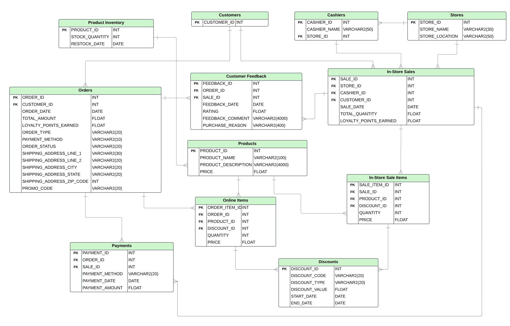
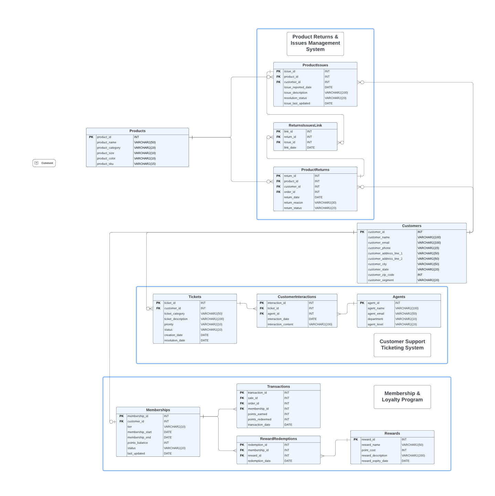
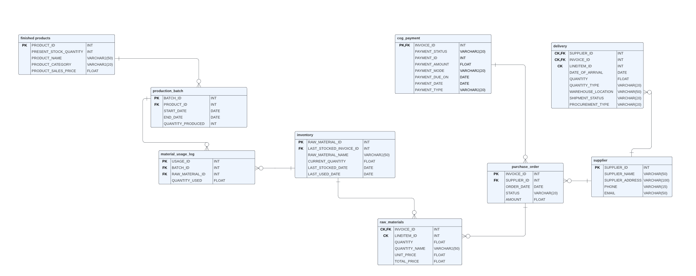
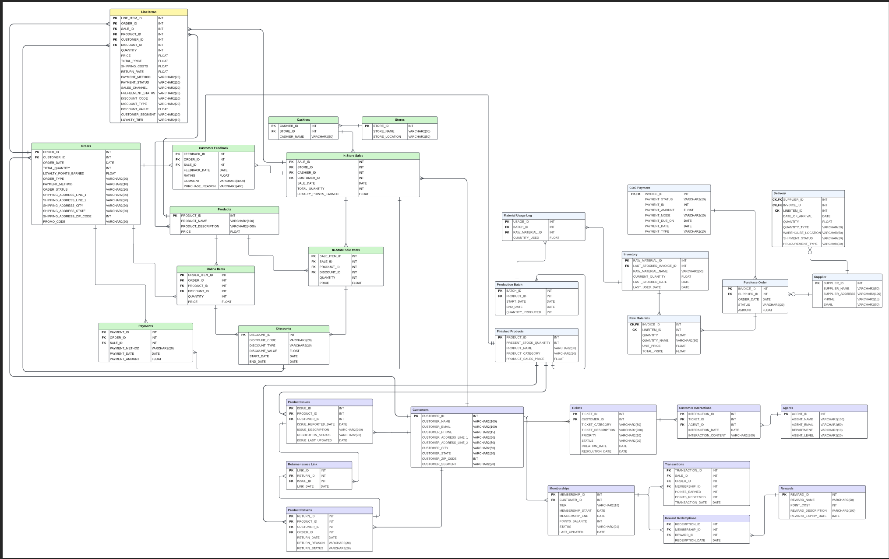

# fashion e-commerce data warehousing 
 
# Lululemon Data Management Strategy Project

---

## Overview

This project presents a comprehensive data management strategy for Lululemon Athletica, focusing on aligning their data infrastructure with their business goals, particularly their "Power of Three ×2" growth strategy. The project encompasses various aspects of data management, including OLTP systems design, data warehouse architecture, data governance, and the integration of semi-structured and unstructured data sources.

## Table of Contents

1. [Data Management Strategy](#data-management-strategy)
2. [OLTP Systems](#oltp-systems)
3. [Data Warehouse](#data-warehouse)
4. [Data Governance](#data-governance)
5. [Unstructured and Semi-Structured Data](#unstructured-and-semi-structured-data)
6. [Authorization Matrix](#authorization-matrix)
7. [Conclusion](#conclusion)

## Data Management Strategy

The project proposes an 80/20 split between offensive and defensive data strategies for Lululemon. This approach aligns with their core values of fostering strong customer relationships, driving innovation, and promoting wellness through high-quality products and experiences.

Data Management Strategy

## OLTP Systems

Three main OLTP systems were designed:

1. Orders and Sales System
2. Customer Support and Service Management System
3. Supply Chain Management System

Each system is represented by an Entity-Relationship Diagram (ERD) that outlines the structure and relationships of the data.

Orders and Sales ERD

Customer Support ERD 

Supply Chain ERD

Data Warehouse

## Data Warehouse

An Enterprise Data Warehouse (EDW) was designed to consolidate data from the OLTP systems, enabling comprehensive analytics and reporting.

Enterprise Data Warehouse ERD

## Data Governance

The data governance framework focuses on:

- Data quality
- Metadata management
- Compliance and privacy for customer data

This approach supports Lululemon's international expansion and ensures scalable, reliable data systems.

## Unstructured and Semi-Structured Data

The project explores leveraging unstructured and semi-structured data sources, including:

- Product reviews from Lululemon's website and competitors
- Customer purchase and return data

These data sources are integrated to enhance personalization and improve customer experiences.

## Authorization Matrix

An authorization matrix was developed to manage access control across different roles within the organization, ensuring data security and integrity.

Authorization Matrix

## Conclusion

This project provided valuable insights into aligning multiple database systems and creating effective data governance and management strategies for Lululemon's unique business needs. It emphasizes the importance of adopting a holistic perspective on data management projects, considering both technical and business aspects.

---

For more detailed information on each aspect of the project, please refer to the individual documents in this repository.

⁂

